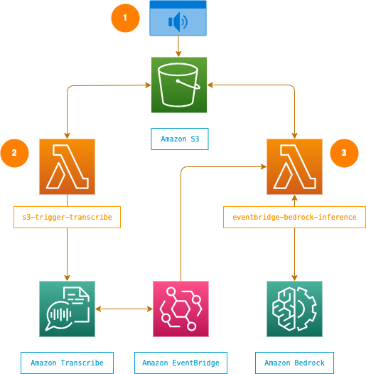
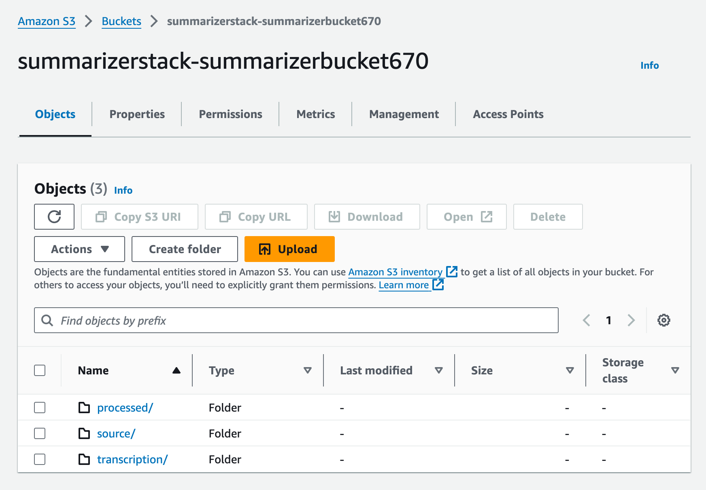

# Summary

This project provides an automated way to transcribe and summarize audio files using AWS. We use Amazon S3, AWS Lambda, Amazon Transcribe, and Amazon Bedrock (with [Claude 3 Sonnet](https://aws.amazon.com/about-aws/whats-new/2024/03/anthropics-claude-3-sonnet-model-amazon-bedrock/)), to create text transcripts and summaries from uploaded audio recordings. 

# Project architecture

The project architecture consists of three main steps:

1. The process is kicked off by uploading an audio file to the `source` folder of an S3 bucket, which is configured with an [event notification](https://docs.aws.amazon.com/AmazonS3/latest/userguide/EventNotifications.html) that notifies a Lambda function when a new object is created. 

2. The Lambda function `s3_trigger_transcribe` receives the event notification, and starts an Amazon Transcribe job using the uploaded file as the source media, saving the results to the `transcription` folder of the S3 bucket.

3. We use an Event Rule from Amazon EventBridge to listen for Amazon Transcribe jobs starting with "summarizer-" that have a `COMPLETED` or `FAILED` state. When detected, details of the Transcribe job are sent to the Lambda function `eventbridge-bedrock-inference`. This function formats the transcript and creates an instruction prompt for a Bedrock large language model (LLM) to summarize the audio content. The results of the summarization are placed in the `processed` folder of the S3 bucket.



# Supported audio formats

This project takes a dependency on Amazon Transcribe, and as such, supports the following [media formats](https://docs.aws.amazon.com/transcribe/latest/dg/how-input.html#how-input-audio): AMR, FLAC, M4A, MP3, MP4, Ogg, WebM, WAV. 

# Sample output

Sample output from audio of two people having a conversation about the Premier League:

**transcription/summarizer-710zilehvp9x.json**

```
{
    "jobName": "summarizer-710zilehvp9x",
    "accountId": "56XXXXXXXXX",
    "status": "COMPLETED",
    "results": {
        "transcripts": [{
            "transcript": "Done. There we go. That's the important part. So Arsenal won yesterday, just top of the table as usual doing as expected. But Man City also won 41. So uh so they were tied with them and one or two behind Liverpool. Yeah, I think we're technically ahead on goal differential or we we're, we're a point ahead of Man City and then technically we're in first place today but when Liverpool wins over the weekend or to tomorrow or today, they'll be two points ahead. Who does Liverpool play next? Pretty sure it's some middling team. Um Oh well it's ok. ..."
        }],
        "speaker_labels": {
            "segments": [{
                        "start_time": "0.0",
                        "end_time": "0.3",
                        "speaker_label": "spk_0",
                        "items": [{
                            "speaker_label": "spk_0",
                            "start_time": "0.009",
                            "end_time": "0.219"
                        }]
                    }, {
                        "start_time": "1.58",
                        "end_time": "4.5",
                        "speaker_label": "spk_0",
                        "items": [{
                                    "speaker_label": "spk_0",
                                    "start_time": "1.659",
                                    "end_time": "1.779"
                                }, {
                                    "speaker_label": "spk_0",
                                    "start_time": "1.789",
                                    "end_time": "1.87"
                                }, {
                                    "speaker_label": "spk_0",
                                    "start_time": "1.879",
                                    "end_time": "2.0"
                                }, ...
```

**processed/summarizer-710zilehvp9x.txt**
```
Here is a summary of the conversation, with speakers denoted as Speaker 1, Speaker 2, etc.:

The conversation revolved around recent English Premier League football matches and the league standings. Speaker 1 mentioned that Arsenal won against Luton Town, while Manchester City also won 4-1. Speaker 2 added that Arsenal and Manchester City are tied, with one or two points behind Liverpool. Speaker 1 clarified that Arsenal is technically ahead of Manchester City on goal differential and one point ahead, putting them in first place currently. However, once Liverpool wins their upcoming match, which Speaker 1 expected to be against a weaker opponent, Liverpool would move two points ahead of Arsenal.

Key action items and follow-ups:

- Check Liverpool's upcoming match and opponent
- Monitor the Premier League standings and goal differentials as matches progress
- Discuss the implications of results on the title race...
```

# Quickstart
This project is written in Python, and uses the AWS CLI and AWS Cloud Development Kit (CDK) to deploy infrastructure. By deploying the architecture and running this process, you may incur charges to your AWS account.

## Prerequisites 
- [Python 3](https://www.python.org/downloads/) and `pip`
- [Node](https://nodejs.org/en)
- [An AWS Account](https://portal.aws.amazon.com/gp/aws/developer/registration/index.html) configured with an [IAM user that has permissions](https://docs.aws.amazon.com/IAM/latest/UserGuide/id_credentials_access-keys.html#Using_CreateAccessKey) to Amazon Transcribe, Amazon Bedrock, AWS Lambda, and Amazon S3.
- [Enable access to Anthropic's Claude 3 Sonnet](https://console.aws.amazon.com/bedrock/home?#/models) via the AWS Bedrock Console.

## Step 1: Clone the repo 

```
git clone https://github.com/aws-samples/amazon-bedrock-audio-summarizer && cd amazon-bedrock-audio-summarizer
```

## Step 2: Setup virtual environment 

Create a virtual env:
```
python3 -m venv venv
``` 

Activate your virtual env:
```
source .venv/bin/activate
```

## Step 3: Install dependencies 
As mentioned earlier, this project requires both the AWS CLI and AWS CDK. Follow the instructions below to setup and configure both. **Note**: You will need your key and secret from the [AWS Console](https://console.aws.amazon.com/) (under IAM).

### AWS CLI

Download the AWS CLI: 
```
curl "https://awscli.amazonaws.com/AWSCLIV2.pkg" -o "AWSCLIV2.pkg"
```

Install the AWS CLI: 
```
sudo installer -pkg ./AWSCLIV2.pkg -target /
```

Validate your installation:
```
aws --version
```

Then, configure your AWS account using IAM credentials (or key/secret). Follow the prompts. 

```
aws configure
```

### AWS CDK

Install the AWS CDK:

```
npm install -g aws-cdk
```

Validate your installation:

```
cdk --version 
```

### Repo dependencies

Pull in dependencies from requirements.txt: 
```
pip install -r requirements.txt
```

## Step 4: Deploy to your account 

Use the CDK to deploy project infrastructure to your account:

```
cdk deploy
```
After deployment, you should see something like this:

```
✨  Synthesis time: 7.53s

SummarizerStack: deploying... [1/1]
SummarizerStack: creating CloudFormation changeset...

 ✅  SummarizerStack (no changes)

✨  Deployment time: 40.77s

Stack ARN:
arn:aws:cloudformation:us-east-1:568125631851:stack/SummarizerStack/fcf...

✨  Total time: 48.3s
```

## Step 5a: Upload audio in the AWS Console

Sign into the [AWS Console](https://console.aws.amazon.com/console/home?nc2=h_ct&src=header-signin).

Navigate to S3. In your account, you should see a folder that starts with `summarizerstack-summarizerbucket...`. Inside of this folder there are `source`, `processed`, and `transcription` folders. 



Drop an audio file into the `source` folder to kick-off the transcription and summarization workflow. As the process moves through the stages, you should see new files placed in the `transcription` and `processed` folders of your bucket. The entire length of the process will depend on the file size of your audio, but in tests with meetings up to 45-minutes in length results were generally available within 3-5 minutes.

## 5b: Upload audio via Jupyter Notebook

Alternatively, you can use the [Jupyter Notebook](./quickstart.ipynb) we've put together to upload audio to S3 and poll for the summary. 

## Step 6: Review results

After some time, you can review the results. First, check the `transcription` folder for the latest .txt file created. It will begin with `summarizer-...`. This is the converted transcript of the audio. Transcription is the longest part of this process. If you do not see a newly created file, wait a few minutes and try again. Once you see a new file has been added, note the random digits that precede ".txt" -- this is a unique job ID the Lambda function assigned when it created a Transcribe job.

Next, look in the `processed` folder for a .txt file with the same name. This is the result of the summarization, which you can download and review.

## Step 7: Clean up

When you're finished, you can remove the infrastructure created to limit recurring charges. Destroy the CDK stack by running the following command from the project directory:
```
cdk destroy 
```

For S3, you may have to manually remove contents from your S3 bucket. 

# Changing models

To change the Bedrock model used for summarization, update the model name, version, and ID in `bedrock-inference/lambda_function.py`. For a full list of models, see [Amazon Bedrock model IDs](https://docs.aws.amazon.com/bedrock/latest/userguide/model-ids.html).

```
# bedrock-inference/lambda_function.py
...
body = json.dumps(
    {
        "anthropic_version": "bedrock-2023-05-31",
        ...
    }

...

response = bedrock_client.invoke_model(
    modelId="anthropic.claude-3-sonnet-20240229-v1:0", body=body
)
...
```

# A few notes on the project structure 

* Each function utilizes `logger` statements to aid in debugging and monitoring execution through CloudWatch logs. 
* Each function includes an `if __name__ == "__main__":` block, which allows you to test and debug the functions locally. Simply replace the sample `event` with data from your own account.

# Troubleshooting

If you upload a file to `source`, but never see a new file placed in `transcription`, or `processed` navigate to the Lambda console and look at the CloudWatch logs for either the `s3_trigger_transcribe` function, or the `eventbridge-bedrock-inference` function.

# Security
See CONTRIBUTING for more information.

# License
This library is licensed under the MIT-0 License. See the LICENSE file.
